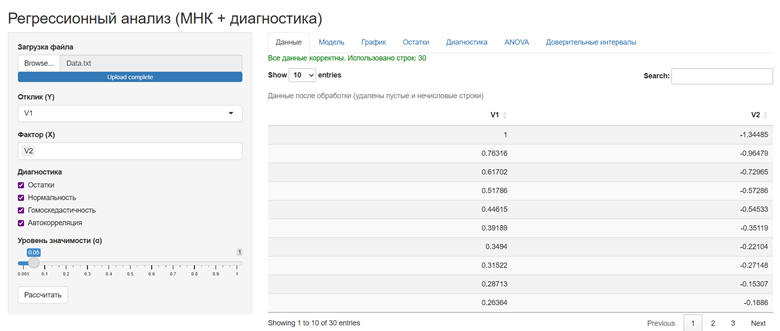
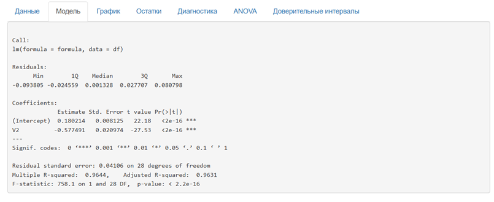
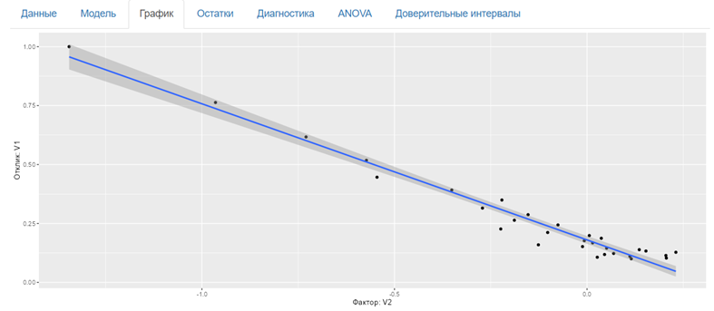
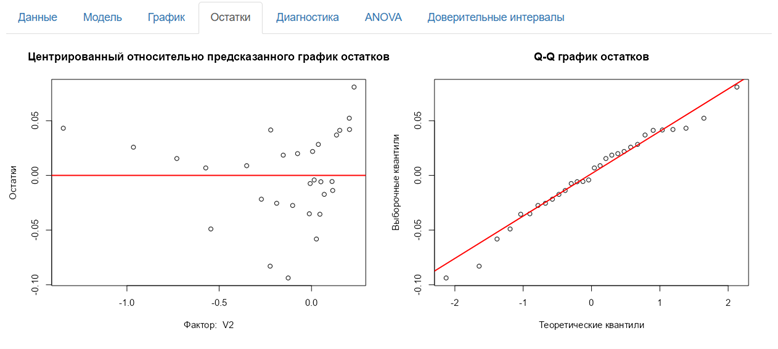
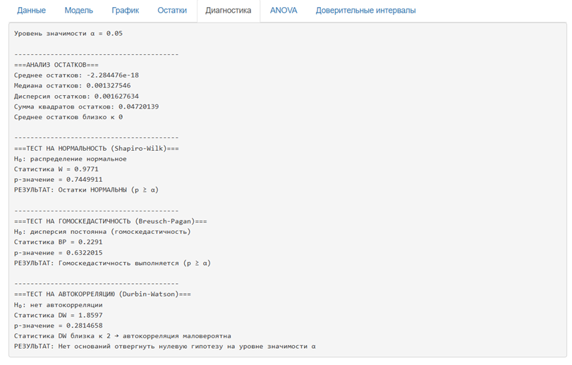
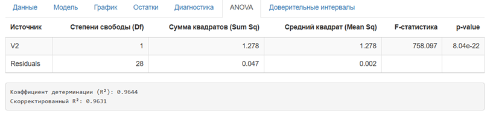
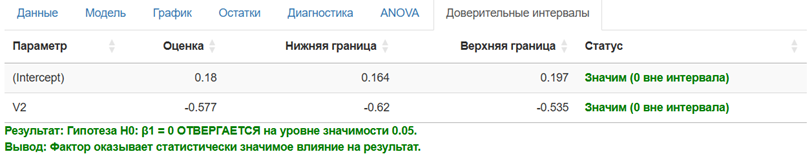

# Regression Analysis App


## Overview


An interactive **R Shiny** application that automates the entire workflow of simple linear regression analysis.


The application allows users to upload their own datasets, fit a linear regression model, perform statistical diagnostics, and visualize the results without writing any code.


\---


\## Features


\- Upload CSV, TXT, and Excel files

\- Select the response variable (Y)

\- Select the predictor variable (X)

\- Fit a linear regression model

\- Regression plot with confidence bands

\- Residual analysis

\- Quantile–Quantile (Q-Q) plot

\- Shapiro–Wilk normality test

\- Breusch–Pagan test for homoscedasticity

\- Durbin–Watson test for autocorrelation

\- Analysis of Variance (ANOVA) table

\- R² and Adjusted R²

\- Confidence intervals for regression coefficients

\- Statistical significance testing of model coefficients


\---


\## Screenshots


\#Control panel and display of uploaded test data



\#Summary of basic information about the model



\#Linear regression plot and confidence band



\#Two plots for the residuals



\#Diagnostic tests



\#Analysis of variance table



\#Confidence intervals for the coefficients. Significance of the model and its parameters



\---


\## Technologies


\- R

\- Shiny

\- ggplot2

\- lmtest

\- car

\- readxl


\---


\## Workflow


1\. Upload a dataset.

2\. Select the response variable (Y).

3\. Select the predictor variable (X).

4\. Configure diagnostic settings.

5\. Click \*\*"Calculate"\*\*.

6\. Review the regression analysis results and diagnostic statistics.


\---


\## Running Locally


```r

install.packages(c(

&#x20; "shiny",

&#x20; "ggplot2",

&#x20; "lmtest",

&#x20; "car",

&#x20; "readxl"

))


shiny::runApp()

```


\---


\## Live Demo


A link to the online application will be added after deployment to \*\*ShinyApps.io\*\*.


```

https://.....

```


\---


\## License


This project is distributed under the \*\*MIT License\*\*.

